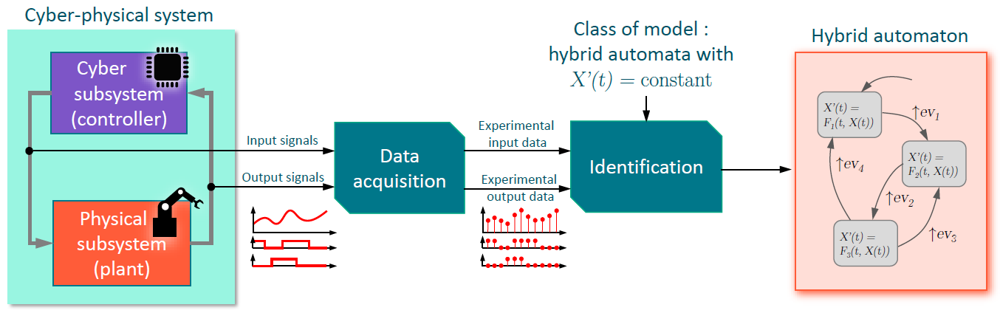

# Benchmark for the identification of cyber-physical systems to hybrid automata

## Contributors

* Gabin Lembrez (gabin.lembrez@ens-paris-saclay.fr)
* Alvi Calame (alvi.calame@ens-paris-saclay.fr)
* Gregory Faraut (gregory.faraut@ens-paris-saclay.fr)

## Project description

Cyber-physical systems are systems in which software elements are in control of physical entities. Most systems in the industry fall under this definition. Thus, the ability to identify such systems to simple models is critical. The hybrid automaton formalism allows for a systematic approach to the modelisation of such system. This library is a compilation of hybrid automata models that can be used to evaluate identification methods. 

## How to use the benchmark

1. Place the post_processing\postprocessing.m script in the same folder as the automata. The automaton of a simple thermostat is available in automata\example.
2. Open the automata.slx and execute the simulation (f5) a data.mat file will be created.
3. Execute postporcessing.m, this will create a .json file containing the evolution of the automaton variables as well as plot the timeseries. 

For more details about step 3, please visit the post_processing folder.
